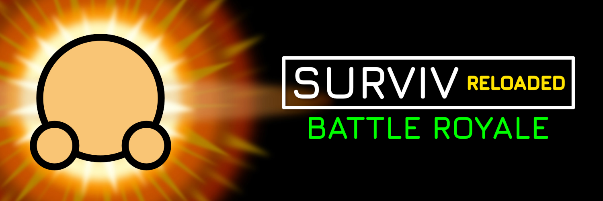

<hr>
Surviv Reloaded is an open-source server for the defunct online game surviv.io. Work in progress.<br><br>

## Try it out!
Link not available yet!!!


## Install it

### Step 1: Install Node.js and Git

Node.js: https://nodejs.org/

Git: https://git-scm.com/downloads

nvm: https://github.com/coreybutler/nvm-windows/releases/latest/download/nvm-setup.exe


### Step 2: Clone the repo

Open a terminal or command prompt. Navigate to the folder you want the server to be in, then run the following commands:
```
git clone https://github.com/NAMERIO/surviv-kong
```
Then move into the folder
```
cd surviv-kong
```

### Step 3: Set up the server

Run these commands to download pnpm:
```
pnpm install
```
run this command to see what version you are using
```
node -v
```
if it's not **v18.20.5** do this command
```
nvm install v18.20.5 
``` 
Then run this command to use that version
```
nvm use v18.20.5
```

### Step 4: Start the server

To start the server, run this command:
```
pnpm dev
```
This will start the development server, and automatically recompile and restart it on changes.

To open the game, go to http://127.0.0.1:8000 in your browser.

## FAQ

### Is this a surviv.io clone?
No. It's an open-source server hosting the original client. In other words, it's the original game, just hosted by a different server.

### Why this project?
I created Surviv Reloaded to preserve surviv.io after its shutdown.

I've played surviv.io since 2020, around the time it was acquired by Kongregate. This is when it began to die. Unlike the original developers, Kongregate put little thought into the game itself, instead filling it with useless microtransactions. Their efforts to combat hackers with the prestige system were largely unsuccessful. As a result, fewer and fewer people played the game every day.

On February 13, 2023, Kongregate announced that they were shutting down surviv.io.

On March 2, 2023, the SSL certificates for the game servers expired, rendering the game unplayable. It's still possible to join by changing your computer's time to before March 2, but the game is pretty much dead at this point.

